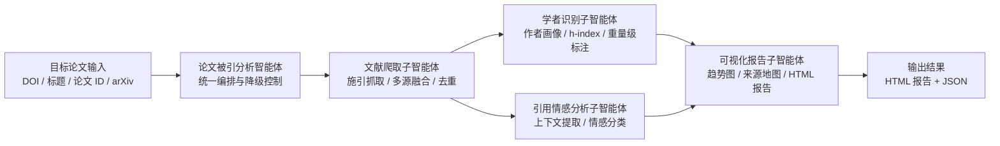

# CiteAnalyzer-Agent

## 简介

`CiteAnalyzer-Agent` 是一个面向单篇目标论文的被引分析智能体项目。系统目标是输入一篇论文后，自动抓取施引文献，识别施引作者中的重点学者，分析引用语境与情感，并生成可视化分析报告。

当前项目仍处于 MVP 设计与落地准备阶段，重点是先把产品边界、智能体架构和实现计划稳定下来，再进入代码实现。

## 目标功能

- 施引文献抓取：围绕目标论文抓取施引文献元数据，并做多源融合与去重
- 学者识别：补充施引作者的 `h-index`、机构、领域信息，标注重量级学者候选
- 引用情感分析：提取引用上下文并判断是正向、中性还是批评性引用
- 可视化报告：生成引用趋势图、引用来源地图、学者分布和情感分布，并导出结构化结果与 HTML 报告

## 当前架构

当前系统采用“一个总智能体 + 多个子智能体”的总分架构：

- `论文被引分析智能体`：总控编排器，负责输入解析、流程调度、降级控制和最终结果汇总
- `文献爬取子智能体`：负责施引文献抓取、多源融合、去重与来源保留
- `学者识别子智能体`：负责作者画像补充、指标查询和重量级学者标注
- `引用情感分析子智能体`：负责引用上下文提取与情感分类
- `可视化报告子智能体`：负责汇总结果并生成 HTML 报告

更完整的说明见：

- [产品规格](docs/product-specs/citation-analysis-mvp.md)
- [架构文档](docs/ARCHITECTURE.md)
- [测试文档](docs/testing/README.md)

## 当前开发进度

已完成：

- 项目名称初始化
- MVP 产品规格初稿与规则收口
- 总智能体 + 子智能体架构文档
- 关键边界约定
  - `Semantic Scholar + Crossref` 为主抓取链路
  - `Google Scholar` 作为补充源，不阻塞主流程
  - `arXiv` 作为输入兼容入口
  - HTML 为当前默认报告输出方向
  - 重量级学者标注采用启发式规则

进行中：

- execution plan 编写

尚未开始：

- 真实代码目录搭建
- 外部数据源适配器实现
- 情感分析模块实现
- HTML 报告生成实现
- 端到端验证

## 仓库结构

- `docs/`：产品规格、架构、计划、历史记录
- `scripts/`：仓库级自动化脚本
- `downloaded-papers/`：本地下载论文和中间缓存
- `apps/` / `packages/` / `infra/`：后续实现阶段逐步落地

## 当前建议的下一步

1. 写完 `docs/exec-plans/active/` 下的 execution plan。
2. 按计划搭建 `apps/analyzer` 和 `packages/*` 代码骨架。
3. 优先实现主链路：目标论文解析、施引抓取、学者识别、情感分析、HTML 报告。

## 许可证

[MIT](LICENSE)
