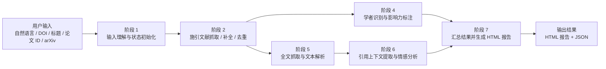

# CiteAnalyzer-Agent

## 简介

`CiteAnalyzer-Agent` 是一个面向单篇目标论文的被引分析智能体项目。系统目标是输入一篇论文后，自动抓取施引文献，识别施引作者中的重点学者，分析引用语境与情感，并生成可视化分析报告。

当前项目已经完成阶段 1 和阶段 2 的主链路落地，并在当前开发分支上推进到阶段 5 / 阶段 6 的原型实现。当前最稳定的能力是目标论文输入理解、施引文献抓取，以及面向真实论文全文的引用上下文定位实验路径。

## 目标功能

- 施引文献抓取：围绕目标论文抓取施引文献元数据，并做多源融合与去重
- 学者识别：补充施引作者的 `h-index`、机构、领域信息，标注重量级学者候选
- 引用情感分析：提取引用上下文并判断是正向、中性还是批评性引用
- 可视化报告：生成引用趋势图、引用来源地图、学者分布和情感分布，并导出结构化结果与 HTML 报告

## 当前架构

当前系统采用“一个总智能体 + 多个子智能体”的总分架构：

- `论文被引分析智能体`：总控编排器，负责输入解析、流程调度、降级控制和最终结果汇总
- `文献爬取子智能体`：负责施引文献抓取、多源融合、去重与来源保留
- `学者识别子智能体`：负责作者画像补充、指标查询和重量级学者标注
- `引用情感分析子智能体`：负责引用上下文提取与情感分类
- `可视化报告子智能体`：负责汇总结果并生成 HTML 报告



更完整的说明见：

- [产品规格](docs/product-specs/citation-analysis-mvp.md)
- [架构文档](docs/ARCHITECTURE.md)
- [测试文档](docs/testing/README.md)

## 如何运行

### 基础要求

- 需要 **Python 3**
- 如果要跑依赖 LLM 的能力，需要在项目根目录准备 `.env`
- 当前仓库**还没有统一冻结的 Python 依赖清单**（例如 `requirements.txt` 或 `pyproject.toml`），因此首次运行前需要先在你的环境里补齐项目依赖

### `.env` 最小配置

当前分析链路会从 `.env` 读取这些变量：

- `API_KEY`
- `BASE_URL`
- `MODEL`

如果要启用 GROBID 路径，还可以显式配置：

- `GROBID_API_URL`

当前默认值见：

- `apps/analyzer/config.py`

其中：

- `API_KEY` / `BASE_URL` / `MODEL` 是 LLM 必填项
- `GROBID_API_URL` 默认回退到 `http://localhost:8070/api`

### 项目级验证入口

如果你只是想确认当前仓库可跑，最直接的入口是：

```bash
bash ./scripts/check-project.sh
```

这个命令会调用：

```bash
python ./scripts/test_agent/run.py
```

## 如何测试

### 聚合验证

```bash
python ./scripts/test_agent/run.py
```

### 单阶段验证

```bash
python ./scripts/test_agent/stage1.py
python ./scripts/test_agent/stage2.py
python ./scripts/test_agent/stage5.py
python ./scripts/test_agent/stage6.py
```

### 常用 live smoke

阶段 5 真实抓取验证：

```bash
STAGE5_FETCH_LIVE=1 python ./scripts/test_agent/stage5.py
```

阶段 6 基于阶段 5 真实产物的验证：

```bash
STAGE6_REAL_CITING5=1 python ./scripts/test_agent/stage6.py
```

阶段 6 的 GROBID 路径验证：

```bash
STAGE6_GROBID_CITING5=1 python ./scripts/test_agent/stage6.py
```

更细的阶段覆盖范围见：

- [阶段验证说明](docs/testing/stage-validation.md)

## 当前开发进度

已完成：

- 项目名称初始化
- MVP 产品规格初稿与规则收口
- 总智能体 + 子智能体架构文档
- 阶段 1：自然语言输入理解与状态初始化
- 阶段 2：`Semantic Scholar + Crossref` 主抓取链路
- 单篇真实 DOI 的阶段 2 在线样本验证
- 阶段 5 原型：`PDF-first` 全文抓取、本地落盘 `raw pdf/html + parsed txt`，不再把 tar 作为正式默认产物
- 阶段 6 原型：`LangGraph` 工作流、`PDF -> GROBID -> context` 主路径、GROBID 不可用时的文本回退路径、真实 `citing-5` 冒烟测试
- 关键边界约定
  - `Semantic Scholar + Crossref` 为主抓取链路
  - `Google Scholar` 作为补充源，不阻塞主流程
  - `arXiv` 作为输入兼容入口
  - HTML 为当前默认报告输出方向
  - 重量级学者标注采用启发式规则

进行中：

- 阶段 4 学者识别实现
- 阶段 6 多上下文返回与更多真实 citing paper 回归
- GROBID 路径向正式 stage6 主流程继续收口
- 阶段 5/6 的 PDF-first 契约继续向总智能体联调收口

尚未完成：

- 学者识别模块完整实现
- HTML 报告生成实现
- 多篇真实样本的端到端验证

## 文件目录

- `apps/analyzer/`
  - 总智能体入口、配置与状态图编排
- `packages/citation_sources/`
  - 阶段 2 的施引文献抓取、标准化、去重与来源客户端
- `packages/sentiment/`
  - 阶段 5 / 6 的全文抓取、GROBID 路径、上下文定位与情感分析
- `scripts/test_agent/`
  - 各阶段验证脚本与聚合验证入口
- `docs/`
  - 产品规格、架构、测试说明、执行计划、history、经验池
- `downloaded-papers/`
  - 本地下载论文和中间缓存
- `infra/`
  - 预留给后续部署、环境定义与编排支撑

更完整的边界说明见：

- [架构文档](docs/ARCHITECTURE.md)

## GROBID 安装（Docker）

如果你要跑阶段 6 的 GROBID 主路径，可以先用 Docker 启一个本地服务。

### 启动命令

```bash
docker run --rm -p 8070:8070 lfoppiano/grobid:0.8.1
```

如果你希望它后台运行：

```bash
docker run -d --name grobid -p 8070:8070 lfoppiano/grobid:0.8.1
```

### 健康检查

服务起来后，检查：

```bash
curl http://localhost:8070/api/isalive
```

正常情况下应返回：

```text
true
```

### `.env` 配置

如果你使用默认端口，可以在 `.env` 中写：

```env
GROBID_API_URL=http://localhost:8070/api
```

阶段 6 的 GROBID smoke 会使用这个地址。

## 当前建议的下一步

1. 继续推进阶段 4，落地学者识别能力与作者画像补充。
2. 让阶段 6 对单篇 citing paper 返回多处引用上下文，而不是只保留一条主上下文。
3. 在更多真实 PDF 论文上补 GROBID 主路径回归，并为直接 LaTeX 来源保留兼容性验证。

## 许可证

[MIT](LICENSE)
