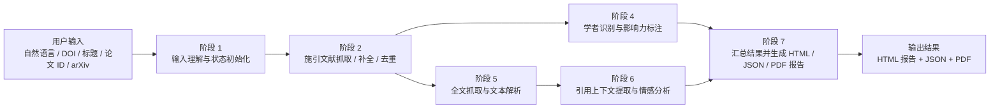

# CiteAnalyzer-Agent

## 简介

`CiteAnalyzer-Agent` 是一个面向单篇目标论文的被引分析智能体项目。系统目标是输入一篇论文后，自动抓取施引文献，识别施引作者中的重点学者，分析引用语境与情感，并生成可视化分析报告。

当前项目已经完成阶段 1 / 2 / 4 / 5 / 6 / 7 的 MVP 主链路。当前最稳定的能力是目标论文输入理解、施引文献抓取、作者画像补全、面向真实论文全文的单上下文引用定位实验路径，以及 HTML / JSON / PDF 报告导出。

## 目标功能

- 施引文献抓取：围绕目标论文抓取施引文献元数据，并做多源融合与去重
- 学者识别：补充施引作者的 `h-index`、机构、领域信息，标注重量级学者候选
- 引用情感分析：提取引用上下文并判断是正向、中性还是批评性引用
- 可视化报告：生成引用趋势图、施引来源国家/地区分布、机构分布、学者分布和情感饼图，并导出结构化结果、HTML 报告与独立 PDF 报告

## 当前架构

当前系统采用“一个总智能体 + 多个子智能体”的总分架构：

- `论文被引分析智能体`：总控编排器，负责输入解析、流程调度、降级控制和最终结果汇总
- `文献爬取子智能体`：负责施引文献抓取、多源融合、去重与来源保留
- `学者识别子智能体`：负责作者画像补充、指标查询和重量级学者标注
- `引用情感分析子智能体`：负责引用上下文提取与情感分类
- `可视化报告子智能体`：负责汇总结果并生成 HTML / JSON / PDF 报告



更完整的说明见：

- [产品规格](docs/product-specs/citation-analysis-mvp.md)
- [架构文档](docs/ARCHITECTURE.md)
- [测试文档](docs/testing/README.md)

## 如何运行

### 基础要求

- 需要 **Python 3**
- 如果要跑依赖 LLM 的能力，需要在项目根目录准备 `.env`
- 当前仓库**还没有统一冻结的 Python 依赖清单**（例如 `requirements.txt` 或 `pyproject.toml`），因此首次运行前需要先在你的环境里补齐项目依赖
- Stage 7 PDF 导出需要 `reportlab`；`requirements-ci.txt` 已包含 CI 最小依赖
- `requirements-ci.txt` 只是 GitHub CI 的最小测试依赖清单，不等同于完整运行时依赖锁文件

### `.env` 最小配置

当前分析链路会从 `.env` 读取这些变量：

- `API_KEY`
- `BASE_URL`
- `MODEL`

如果要启用 GROBID 路径，还可以显式配置：

- `GROBID_API_URL`

当前默认值见：

- `apps/analyzer/config.py`

其中：

- `API_KEY` / `BASE_URL` / `MODEL` 是 LLM 必填项
- analyzer 会优先读取仓库根目录 `.env`；本地 `.env` 会覆盖当前 shell 中已有的同名 LLM 环境变量
- 本地运行 `scripts/test_agent/stage7.py` 默认跳过真实 LLM smoke；GitHub CI 会强制真实调用 LLM 验证国家/地区解析，并要求 CI 环境中的 `MODEL=gpt-5.4`
- GitHub CI 需要在仓库 Secrets 中配置 `API_KEY` 和 `BASE_URL`；workflow 会固定传入 `MODEL=gpt-5.4`
- `GROBID_API_URL` 默认回退到 `http://localhost:8070/api`

### 项目级验证入口

如果你只是想确认当前仓库可跑，最直接的入口是：

```bash
bash ./scripts/check-project.sh
```

这个命令会调用：

```bash
python ./scripts/test_agent/run.py
```

如果需要查看每个阶段的详细日志，可以通过环境变量开启：

```bash
CITE_ANALYZER_STAGE_LOG=detail bash ./scripts/check-project.sh
```

正式 analyzer 运行链路也支持中文 runtime 日志：

```bash
CITE_ANALYZER_RUNTIME_LOG=detail python ./scripts/test_agent/e2e_real_smoke.py --target https://arxiv.org/abs/2504.19162 --max-citations 3 --log detail
```

`e2e_real_smoke.py` 会访问外部学术 API，是 opt-in live smoke，不包含在默认 `check-project.sh` 中。稳定的 runtime 日志 contract 使用本地 fake/fixture：

```bash
python ./scripts/test_agent/runtime_logging_contract.py
```

## 如何测试

### 聚合验证

```bash
python ./scripts/test_agent/run.py
```

聚合入口支持两种日志模式：

```bash
python ./scripts/test_agent/run.py --log brief
python ./scripts/test_agent/run.py --log detail
```

- `brief` 是默认模式，只输出阶段级摘要、通过 / 跳过 / 失败信息。
- `detail` 会额外输出样本路径、候选数量、产物路径、降级信息等调试细节。
- 日志中会使用少量 emoji 和分段符号方便阅读，但 `START` / `PASS` / `FAIL` / `SKIP` / `DETAIL` 等稳定文本会始终保留。

这个入口当前聚合：

- `import_contract.py`
- `stage1.py`
- `stage2.py`
- `stage4.py`
- `stage5.py`
- `stage6.py`
- `stage56_integration.py`
- `stage7.py`
- `e2e_mvp.py`

并显式提示：

- `stage3.py`

`run.py` 当前已经聚合到 fixture-backed `e2e_mvp.py`，只剩 `stage3.py` 继续保持待接入状态。
其中 `import_contract.py` 会先验证阶段 1 的导入链不会因为阶段 5 的可选依赖而提前失败。

### 单阶段验证

```bash
python ./scripts/test_agent/stage1.py
python ./scripts/test_agent/stage2.py
python ./scripts/test_agent/stage4.py
python ./scripts/test_agent/stage5.py
python ./scripts/test_agent/stage6.py
python ./scripts/test_agent/stage56_integration.py
python ./scripts/test_agent/stage7.py
```

单阶段详细日志可通过环境变量开启：

```bash
CITE_ANALYZER_STAGE_LOG=detail python ./scripts/test_agent/stage6.py
```

PowerShell 写法：

```powershell
$env:CITE_ANALYZER_STAGE_LOG="detail"; python ./scripts/test_agent/stage6.py
```

后续新增但当前仍为占位 / 待实现的入口：

```bash
python ./scripts/test_agent/stage3.py
python ./scripts/test_agent/stage8.py
```

### 常用 live smoke

正式 analyzer 中文日志 live smoke：

```bash
python ./scripts/test_agent/e2e_real_smoke.py --target https://arxiv.org/abs/2504.19162 --max-citations 3 --log detail
```

阶段 5 真实抓取验证：

```bash
STAGE5_FETCH_LIVE=1 python ./scripts/test_agent/stage5.py
```

阶段 6 基于阶段 5 真实产物的验证：

```bash
STAGE6_REAL_CITING5=1 python ./scripts/test_agent/stage6.py
```

阶段 6 的 GROBID 路径验证：

```bash
STAGE6_GROBID_CITING5=1 python ./scripts/test_agent/stage6.py
```

更细的阶段覆盖范围见：

- [阶段验证说明](docs/testing/stage-validation.md)

## 当前开发进度

已完成：

- 项目名称初始化
- MVP 产品规格初稿与规则收口
- 总智能体 + 子智能体架构文档
- 阶段 1：自然语言输入理解与状态初始化
- 阶段 2：`Semantic Scholar + Crossref` 主抓取链路
- 单篇真实 DOI 的阶段 2 在线样本验证
- 阶段 5 原型：`PDF-first` 全文抓取、本地落盘 `raw pdf/html + parsed txt`，不再把 tar 作为正式默认产物
- 阶段 5 下载失败恢复：当论文正文拿不到时，会显式返回恢复建议（优先检查 DOI 落地页、作者 PDF / 预印本、或手动补 `source_links`），并在可用时退回摘要
- 阶段 6 原型：`LangGraph` 工作流、`PDF -> GROBID -> context` 主路径、GROBID 不可用时的文本回退路径、真实 `citing-5` 冒烟测试
- 阶段 4 模块级实现：`packages/author_intel/`、`AuthorProfile` / `ScholarLabel`、`OpenAlex + DBLP` 画像补全链路、`stage4.py` 验证脚本
- analyzer 总控现已接回阶段 4 / 5 / 6，并把 scholar / fulltext / sentiment 结果写回共享状态
- 阶段 7 报告实现：HTML / JSON / PDF 报告导出、chart payload、情感饼图、机构与国家/地区分布、重要学者表格、代表性引用语境、上游 partial failure / weak-signal / state error 的降级提示
- 独立 E2E 入口：`e2e_mvp.py` 通过已保存真实 stage2 样本和本地 fixture 跑通 analyzer 全链路
- `run.py` 当前已聚合 `stage56_integration.py`，默认项目级入口 `bash ./scripts/check-project.sh` 在 bash/WSL 环境会优先复用可用的 `python.exe`
- 关键边界约定
  - `Semantic Scholar + Crossref` 为主抓取链路
  - `Google Scholar` 作为补充源，不阻塞主流程
  - `arXiv` 作为输入兼容入口
  - HTML 为当前默认报告输出方向
  - 重量级学者标注采用启发式规则
  - 阶段 6 当前冻结为“每篇 citing paper 只返回一条主 `CitationContext`”
  - `stage7.py` 只承担报告级 contract 验证
  - `e2e_mvp.py` 预留为独立真实样本总控验证入口

进行中：

- OpenAlex / DBLP、PDF / HTML、GROBID 相关 live smoke 覆盖仍偏少，需要继续补真实样本回归
- `stage3.py` 继续保留为补充源探索占位

尚未完成：

- `Google Scholar` 补充源探索与对应验证脚本
- 统一冻结的 Python 依赖清单与跨解释器环境说明

## 文件目录

- `apps/analyzer/`
  - 总智能体入口、配置与状态图编排
- `packages/citation_sources/`
  - 阶段 2 的施引文献抓取、标准化、去重与来源客户端
- `packages/author_intel/`
  - 阶段 4 的作者画像补全、弱标注与重量级学者规则
- `packages/sentiment/`
  - 阶段 5 / 6 的全文抓取、GROBID 路径、上下文定位与情感分析
- `scripts/test_agent/`
  - 各阶段验证脚本与聚合验证入口
- `docs/`
  - 产品规格、架构、测试说明、执行计划、history、经验池
- `downloaded-papers/`
  - 本地下载论文和中间缓存
- `infra/`
  - 预留给后续部署、环境定义与编排支撑

更完整的边界说明见：

- [架构文档](docs/ARCHITECTURE.md)

## GROBID 安装（Docker）

如果你要跑阶段 6 的 GROBID 主路径，可以先用 Docker 启一个本地服务。

### 启动命令

```bash
docker run --rm -p 8070:8070 lfoppiano/grobid:0.8.1
```

如果你希望它后台运行：

```bash
docker run -d --name grobid -p 8070:8070 lfoppiano/grobid:0.8.1
```

### 健康检查

服务起来后，检查：

```bash
curl http://localhost:8070/api/isalive
```

正常情况下应返回：

```text
true
```

### `.env` 配置

如果你使用默认端口，可以在 `.env` 中写：

```env
GROBID_API_URL=http://localhost:8070/api
```

阶段 6 的 GROBID smoke 会使用这个地址。

## 当前建议的下一步

1. 为 OpenAlex / DBLP、更多 PDF / HTML 全文样本补 live smoke，缩小当前测试评分里“真实回归偏少”的缺口。
2. 梳理并冻结最小可运行 Python 依赖清单，减少 PowerShell / bash / WSL 解释器分叉带来的验证噪音。
3. 在主链路 live coverage 达标后，再决定是否推进 `stage3` 的 `Google Scholar` 补充源探索。

## 许可证

[MIT](LICENSE)
