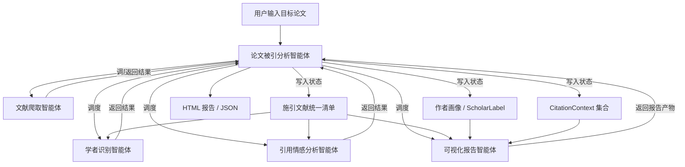

# 架构总览

这份文档描述 `CiteAnalyzer-Agent` 当前面向 MVP 的目标架构。当前项目不是通用模板仓库，而是一个围绕“单篇目标论文被引分析”展开的智能体系统。

系统整体对外表现为一个完整的 `论文被引分析智能体`。在内部，它按需调度多个保持原始命名不变的子智能体。每个子智能体都不是单纯的固定函数模块，而是围绕各自任务目标、以大模型为中心并按需调用工具完成工作的能力单元。

这份文档同时承担仓库级架构说明的职责，因此除了智能体结构外，也需要明确仓库顶层结构、包边界、数据流、可观测性和本地运行方式。

## 仓库顶层结构

当前仓库和后续推荐结构如下：

- `apps/`：可部署的应用、服务或入口。当前建议将总智能体入口放在 `apps/analyzer/`
- `packages/`：跨应用复用的库、契约和共享能力。核心业务逻辑应优先沉淀到这里
- `infra/`：部署、基础设施和环境定义。当前 MVP 可暂时为空，但后续部署、任务编排和环境配置应收敛到这里
- `scripts/`：仓库级自动化脚本，供人和 Agent 直接调用
- `docs/`：仓库知识库，也是本地规则和上下文的正式来源
- `downloaded-papers/`：本地下载论文或中间缓存目录，不应承载核心业务逻辑

## 架构边界原则

为和仓库原始模板保持一致，当前架构遵循以下边界原则：

- 业务逻辑优先沉淀到可复用 `packages/` 中，不直接堆在 `apps/` 入口里
- 基础设施、部署配置和运行编排应显式版本化落在 `infra/` 中，不依赖手工步骤
- 避免隐式跨包耦合；智能体之间只能通过清晰的数据对象和约定接口交互
- 只要架构有变化，就同步更新本文件和相关产品规格文档

## 系统定位

当前系统定位为单次分析型智能体，而不是长期运行的平台型产品。

MVP 具备以下特点：

- 以单篇目标论文为分析单位
- 以外部学术数据源为主，不自建大规模学术数据库
- 以可解释的规则和可替换的分析能力为主，不依赖重训练模型
- 以报告交付为核心输出，而不是实时交互式前端

## 总体智能体架构

系统整体由以下角色构成：

- `论文被引分析智能体`
- `文献爬取智能体`
- `学者识别智能体`
- `引用情感分析智能体`
- `可视化报告智能体`

整体数据流如下：

`目标论文输入 -> 论文被引分析智能体 -> 按需调用各子智能体 -> 汇总结果 -> 输出结果`

## 总智能体

### 论文被引分析智能体

职责：

- 接收用户输入的目标论文
- 完成目标论文输入解析与统一标识
- 维护当前分析状态
- 按需调度各个子智能体
- 汇总各阶段结果并决定最终输出
- 在局部失败时控制降级策略，而不是直接整体失败

输入：

- DOI
- 标题
- 论文 ID
- arXiv 链接
- 可选分析参数

输出：

- 施引文献分析结果
- 重量级学者标注结果
- 引用情感分析结果
- HTML 报告
- 结构化 JSON 结果

边界：

- 总智能体负责编排与状态推进，不负责承载每个分析步骤的具体实现细节
- 输入解析、统一标识、错误处理和降级控制由总智能体统一吸收，不单独抬成架构主角
- 子智能体默认消费标准化后的目标论文对象，而不重复拥有目标论文标准化职责
- 总智能体本身也可以是以大模型为中心的 agent，只是它的自治范围是“全局调度与状态推进”，而不是具体领域分析

## 子智能体架构

### 1. 文献爬取智能体

职责：

- 围绕“获取目标论文的施引文献”这一目标工作
- 根据总智能体提供的目标论文统一标识抓取施引文献元数据
- 在多个外部来源之间按需调用查询工具
- 处理多源结果合并、去重和来源保留
- 在需要时补抓或重新校验文献元数据

输入：

- 标准化后的目标论文对象
- 数据源配置

输出：

- 施引文献统一清单
- 去重后的标准化记录
- 原始来源追踪信息

主要工具 / 数据源：

- `Semantic Scholar API`
- `Crossref API`
- `Google Scholar` 爬取工具（补充源）

边界：

- `Semantic Scholar + Crossref` 构成施引文献主链路
- `Google Scholar` 作为补充源纳入 MVP 设计，但不作为主流程依赖
- `arXiv` 仅作为目标论文输入兼容入口，不作为施引数据主抓取源
- 该智能体不负责学者影响力标注、情感分类和最终报告生成
- 该智能体可以在自己的任务域内决定调用哪些抓取工具以及是否继续补抓，但不负责全局流程决策

### 2. 学者识别智能体

职责：

- 围绕“理解施引作者的学术影响力”这一目标工作
- 补充施引作者画像
- 查询作者的 `h-index`、机构和领域信息
- 按 MVP 规则输出“高影响力作者候选”和“重量级学者候选”

输入：

- 标准化施引作者列表
- 作者 ID 或可用于消歧的作者信息
- 作者所属机构信息

输出：

- 作者标准化画像
- 作者指标信息
- 重量级学者标注结果
- 作者与机构聚合统计

主要工具 / 数据源：

- `OpenAlex`
- `DBLP`

标注规则：

- 第一版采用启发式规则标注“重量级学者候选”，不做跨领域标准化排名
- 若作者在可获取数据源中的 `h-index >= 30`，则标记为“高影响力作者候选”
- 若作者在目标论文的施引文献集合中出现 2 次及以上，则提高其候选优先级
- 若作者同时满足 `h-index` 达标和多次施引两个条件，则标记为“重量级学者候选”
- 若缺少 `h-index` 数据，则仅基于施引频次和机构信息做弱标注，并在结果中注明“证据不足”
- 机构信息只作为辅助信号，不单独决定重量级学者标注结果

边界：

- 该智能体不负责文献抓取、全文提取和报告排版
- 该智能体可以在自己的任务域内决定如何组合 `OpenAlex` / `DBLP` 结果，但不负责全局流程推进

### 3. 引用情感分析智能体

职责：

- 围绕“理解引用态度”这一目标工作
- 提取施引文献中针对目标论文的引用上下文
- 对引用进行正向 / 中性 / 批评性分类
- 在上下文缺失时显式返回“无法判断”

输入：

- 标准化施引文献
- 阶段 5 提供的全文文本或文本片段
- 目标论文在施引文献中的引用标记

输出：

- 引用上下文片段
- 情感标签
- 可选置信度或解释信息

主要工具 / 数据源：

- 全文抓取或文本提取工具
- `LLM zero-shot` 引用定位与情感分类能力
- `arXiv` 公开全文入口（作为抓取失败时的补充回退源）

方法约束：

- 第一版以 `LLM zero-shot` 为中心完成引用定位与情感分类
- 第一版仅对成功提取到引用上下文的记录执行情感分析
- 不提供人工复核接口
- 全文缺失时允许模块降级，不阻塞整份报告生成
- 当 LLM 不可用或结构化输出失败时，阶段 6 应直接报错，而不是静默退化成规则链
- 全文获取优先按施引论文标题查询 `arXiv`，命中后优先使用 `arXiv` 的公开全文；其他来源作为后续补充链路

边界：

- 该智能体不负责作者识别、多源元数据融合和最终报告生成
- 该智能体可以在自己的任务域内选择调用文本提取和 LLM 分类能力，但不负责全局流程推进

### 4. 可视化报告智能体

职责：

- 围绕“组织并输出最终结果”这一目标工作
- 汇总标准化后的施引文献、作者标注和情感结果
- 生成摘要、图表和最终报告
- 输出用户可直接阅读的结论和待人工关注项

输入：

- 标准化文献数据
- 学者识别结果
- 情感分析结果

输出：

- 结构化摘要
- 图表产物
- HTML 报告
- 结构化 JSON 结果

主要工具 / 数据源：

- `Matplotlib`
- `Pyecharts`
- HTML 报告模板或导出能力

MVP 报告至少包含：

- 目标论文基础信息
- 引用数量与年份趋势
- 引用来源地图
- 重量级学者分布与代表作者列表
- 引用情感分布
- 主要观察结论与待人工关注项

引用来源地图定义：

- 引用来源地图基于施引作者所属机构的国家 / 地区信息生成，用于展示目标论文影响力的地理来源分布
- 若一篇施引论文存在多个作者机构，第一版优先按第一作者机构统计
- 若机构信息缺失，则该记录不纳入地图统计

边界：

- 当前文档与产品规格对齐为 `HTML` 优先
- 若后续确定首版必须交付 `PDF`，应同步更新本文件和产品规格
- 该智能体不直接访问外部学术 API，不重新执行上游分析
- 该智能体可以在自己的任务域内决定如何组织摘要和图表，但不回调上游抓取或识别逻辑

## 智能体调度逻辑

系统采用“总智能体统一调度，子智能体按需调用”的结构，而不是把所有分析步骤固化为不可变化的线性流水线。

调度关系如下：

- `论文被引分析智能体` 负责统一调度四个子智能体
- `文献爬取智能体` 产出的施引文献统一清单由 `学者识别智能体` 和 `引用情感分析智能体` 消费
- `学者识别智能体` 与 `引用情感分析智能体` 的输出结果由 `可视化报告智能体` 消费
- 子智能体之间不直接互相调度，由 `论文被引分析智能体` 统一控制执行顺序和降级策略

约束：

- 报告生成不直接访问外部 API
- 学者识别不负责全文抓取
- 情感分析不负责文献去重
- 智能体之间通过清晰的数据对象交互，不通过隐式脚本状态传递

## 共享数据模型建议

MVP 至少需要维护以下核心对象：

### TargetPaper

表示目标论文统一实体。

关键字段建议：

- `canonical_id`
- `title`
- `doi`
- `source_ids`
- `year`
- `authors`
- `input_type`
- `resolve_status`

### CitingPaper

表示施引文献统一实体。

关键字段建议：

- `canonical_id`
- `title`
- `authors`
- `year`
- `doi`
- `source_links`
- `source_names`

### AuthorProfile

表示施引作者统一画像。

关键字段建议：

- `author_id`
- `name`
- `affiliations`
- `fields`
- `h_index`
- `source_ids`

### ScholarLabel

表示重量级学者标注结果。

关键字段建议：

- `author_id`
- `label`
- `evidence`
- `confidence_note`

### CitationContext

表示单条引用上下文及情感结果。

关键字段建议：

- `citing_paper_id`
- `context_text`
- `sentiment_label`
- `evidence_note`

### ReportArtifact

表示最终报告及其图表产物。

关键字段建议：

- `report_id`
- `target_paper_id`
- `summary`
- `charts`
- `export_paths`

## 仓库结构建议

当前仓库已经有阶段 1 / 阶段 2 的真实代码落点，后续建议继续按下面结构扩展：

- `apps/analyzer/`
  - `论文被引分析智能体` 的入口与编排逻辑
- `packages/citation-sources/`
  - 支撑 `文献爬取智能体`
- `packages/author-intel/`
  - 支撑 `学者识别智能体`
- `packages/sentiment/`
  - 支撑 `引用情感分析智能体`
- `packages/reporting/`
  - 支撑 `可视化报告智能体`
- `packages/shared/`
  - 共享类型、配置、日志和错误模型
- `downloaded-papers/`
  - 本地下载的论文或中间文件缓存
- `infra/`
  - 后续部署、任务编排、环境定义和运行支撑配置
- `scripts/`
  - 仓库级自动化脚本
- `docs/`
  - 产品规格、架构、计划和历史记录

包边界建议：

- `apps/analyzer` 只负责总智能体编排和 CLI / 入口装配，不承载分析规则实现
- `packages/citation-sources` 只负责外部学术数据源适配和标准化输出
- `packages/author-intel` 只负责作者画像、指标查询和重量级学者标注
- `packages/sentiment` 只负责上下文提取与情感分类
- `packages/reporting` 只负责图表生成与 HTML 报告导出
- `packages/shared` 承载跨包共享类型、配置、日志和错误模型，不反向依赖业务包

当前已存在的真实代码目录：

- `apps/analyzer/`
  - 阶段 1 输入理解
  - 阶段 2 状态图入口
- `packages/shared/`
  - 共享模型与错误
- `packages/citation_sources/`
  - 阶段 2 的抓取、标准化、去重和外部源客户端
- `packages/sentiment/`
  - 阶段 5 的 `arXiv` 优先全文获取与文本解析
  - 阶段 6 的 LLM 引用定位与 LLM 情感分类

## 运行模式

MVP 优先支持本地单次分析模式：

1. 用户提供目标论文输入
2. `论文被引分析智能体` 解析目标论文并维护分析状态
3. 总智能体调用 `文献爬取智能体` 抓取并融合施引记录
4. 总智能体按需调用 `学者识别智能体`
5. 总智能体执行全文抓取与文本解析阶段
6. 总智能体按文本可用性调用 `引用情感分析智能体`
7. 总智能体调用 `可视化报告智能体` 生成 JSON 和 HTML 报告

不要求：

- 常驻服务
- 在线多用户系统
- 持久任务调度平台

## 失败与降级策略

系统应支持局部失败而非整体失败。

降级原则：

- 补充源失败：继续主流程
- 全文缺失：跳过该条情感分析，标记“无法判断”
- 作者指标缺失：允许输出“证据不足”的弱标注
- 单个子智能体失败：由总智能体决定是否继续后续流程，并在报告中暴露失败来源和影响范围

## 可观测性要求

MVP 至少保留以下可观测信息：

- 每个外部数据源的请求状态
- 每条施引记录的来源信息
- 去重前后记录数量
- 情感分析成功 / 失败数量
- 重量级学者标注命中数量
- 报告生成结果与导出路径

## 后续扩展方向

当前架构应为以下扩展留接口，但不在 MVP 内交付：

- 多篇目标论文联合分析
- 主题级学术影响力分析
- 更强的作者影响力打分模型
- 更高精度的引用情感分类器
- PDF 与更多交付格式
- 交互式 Web UI
- 基于状态图或 agent graph 的更强调度实现

## 文档同步要求

以下内容变化时，应同步更新本文件：

- MVP 输入输出边界变化
- 外部数据源优先级变化
- 各智能体职责边界变化
- 重量级学者标注规则变化
- 报告交付格式变化
- 仓库真实代码结构变化
