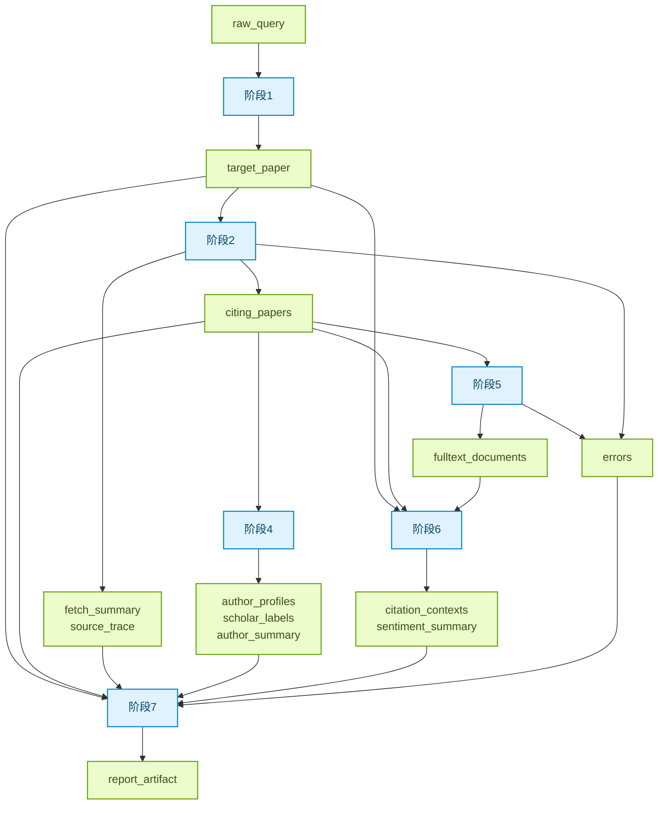
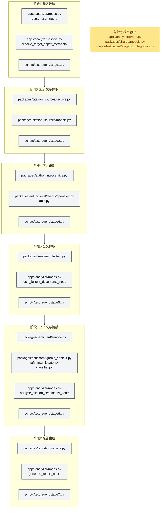
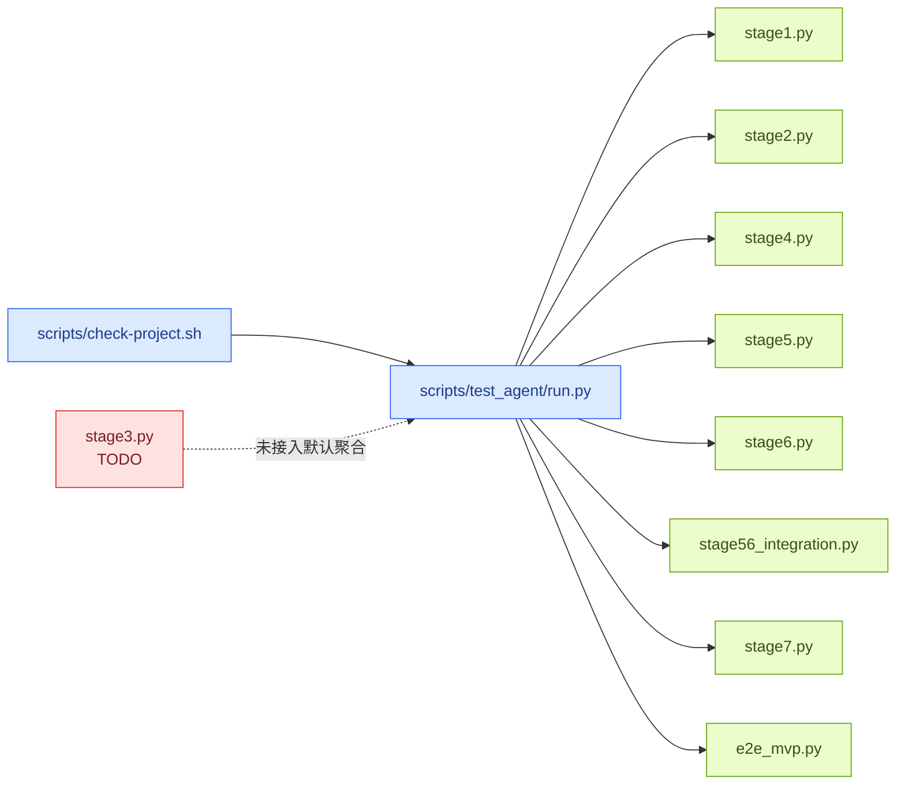

# 引用分析阶段图谱

当前状态：适用于当前 MVP 主链路 `1 -> 2 -> 4 -> 5 -> 6 -> 7`。  
摘要：这份文档把当前版本的 CiteAnalyzer 分成三个视角来解释：
- 用户视角：用户看到的一次分析流程
- 开发者视角：`AnalysisState` 如何逐阶段长出来
- 实现视角：每个阶段落在哪些代码路径

## 📌 适用范围

- 当前默认主链路包含：阶段 1、2、4、5、6、7
- `stage3.py` 仍是补充源探索占位，不在默认主链路
- 当前执行边是**线性**的，不是阶段 2 之后并行扇出
- 阶段 6 当前冻结为：每篇 citing paper 只返回一条主 `CitationContext`
- 阶段 7 当前默认输出为 `HTML + JSON`，并暴露降级与 provenance 信息
- 为兼容 Typora 的 Mermaid 渲染，本文件避免使用较新的 `accTitle:` / `accDescr:` 语法

## 👤 用户视角流程图

这个视角回答的是：“用户给系统一条请求以后，会经历哪些阶段，最后拿到什么？”

```mermaid
flowchart LR
    input["用户输入<br/>DOI / 标题 / openalex:id / arXiv"]
    s1["阶段1<br/>输入理解与目标论文初始化"]
    s2["阶段2<br/>施引文献抓取与来源保留"]
    s4["阶段4<br/>学者识别与重量级标注"]
    s5["阶段5<br/>全文抓取与解析"]
    s6["阶段6<br/>引用上下文与情感分析"]
    s7["阶段7<br/>HTML / JSON 报告生成"]
    output["输出<br/>报告摘要 / 图表 / HTML / JSON"]

    input --> s1 --> s2 --> s4 --> s5 --> s6 --> s7 --> output

    classDef stage fill:#dbeafe,stroke:#2563eb,stroke-width:1.5px,color:#1e3a8a
    classDef io fill:#fef3c7,stroke:#d97706,stroke-width:1.5px,color:#92400e

    class s1,s2,s4,s5,s6,s7 stage
    class input,output io
```

### 用户真正关心的阶段含义

| 阶段 | 用户能理解成什么 |
| --- | --- |
| 阶段1 | 先判断你是不是在问“单篇论文被引分析”，并识别目标论文是谁 |
| 阶段2 | 去外部学术源抓“谁引用了这篇论文” |
| 阶段4 | 看这些施引作者里，谁更值得重点关注 |
| 阶段5 | 尽量拿到 citing paper 的全文或可分析文本 |
| 阶段6 | 找出 citing paper 里是怎么提目标论文的，并判断引用态度 |
| 阶段7 | 把上面这些结果组织成可直接读的报告 |

### 用户视角下的输入输出

| 阶段 | 输入 | 输出 |
| --- | --- | --- |
| 阶段1 | `raw_query` | 标准化后的 `target_paper` 与分析目标 |
| 阶段2 | 已解析的目标论文 | 施引文献列表、抓取摘要、来源追踪 |
| 阶段4 | 施引文献作者信息 | 作者画像、学者标注、聚合统计 |
| 阶段5 | 施引文献列表 | 全文文本或降级结果 |
| 阶段6 | 全文文本 + 目标论文信息 | 主引用上下文、情感标签、分类汇总 |
| 阶段7 | 全部上游结果 | 最终 `ReportArtifact`、HTML、JSON |

## 🧠 开发者视角状态演化图

这个视角回答的是：“系统内部的共享状态是怎么逐步被填满的？”

### 当前 `AnalysisState` 最关键字段

| 字段 | 何时出现 | 含义 |
| --- | --- | --- |
| `target_paper` | 阶段1 | 目标论文统一实体，包含 `paper_query_type`、`doi`、`resolve_status` |
| `citing_papers` | 阶段2 | 去重后的施引文献统一列表 |
| `fetch_summary` | 阶段2 | 抓取规模、去重规模、是否部分失败 |
| `source_trace` | 阶段2 | 每条施引记录来自哪些外部源 |
| `author_profiles` | 阶段4 | 施引作者画像 |
| `scholar_labels` | 阶段4 | `high_impact_candidate` / `heavyweight_candidate` / `weak_signal_candidate` |
| `fulltext_documents` | 阶段5 | 每篇 citing paper 的全文或解析文本 |
| `citation_contexts` | 阶段6 | 每篇 citing paper 的主引用上下文 |
| `sentiment_summary` | 阶段6 | 引用情感统计与 `unknown` 计数 |
| `errors` | 多阶段 | 局部失败与降级说明，不代表整链路立即终止 |
| `report_artifact` | 阶段7 | 最终结构化报告对象 |

### 当前实现里的几个硬约束

| 约束 | 含义 |
| --- | --- |
| `target_paper.resolve_status == resolved` 才能进入阶段 2 | 目标论文解析是抓取前的硬前置 |
| `paper_id` 当前主要指 `openalex:<id>` | 不是泛化支持任意论文库 ID |
| 阶段5 逐篇抓全文 | 单篇失败记到 `errors`，不强制中断整链路 |
| 阶段6 单篇只产一条主 `CitationContext` | 当前不是多上下文抽取系统 |
| 阶段7 报告会暴露 provenance | `fetch_summary`、`source_trace`、`errors`、弱标注 `confidence_note` 会进入报告 |

## 🛠️ 实现视角代码路径图

这个视角回答的是：“如果我要改某一阶段，应该先去看哪些文件？”

### 阶段到代码路径对照表

| 阶段 | 总控入口 | 主要业务实现 | 主要验证脚本 |
| --- | --- | --- | --- |
| 阶段1 | `apps/analyzer/nodes.py::parse_user_query` / `resolve_target_paper_node` | `apps/analyzer/resolve.py` | `scripts/test_agent/stage1.py` |
| 阶段2 | `apps/analyzer/nodes.py::fetch_citation_candidates_node` | `packages/citation_sources/*` | `scripts/test_agent/stage2.py` |
| 阶段4 | `apps/analyzer/nodes.py::analyze_author_intel_node` | `packages/author_intel/*` | `scripts/test_agent/stage4.py` |
| 阶段5 | `apps/analyzer/nodes.py::fetch_fulltext_documents_node` | `packages/sentiment/fulltext.py` | `scripts/test_agent/stage5.py` |
| 阶段6 | `apps/analyzer/nodes.py::analyze_citation_sentiments_node` | `packages/sentiment/*` | `scripts/test_agent/stage6.py` |
| 阶段7 | `apps/analyzer/nodes.py::generate_report_node` | `packages/reporting/service.py` | `scripts/test_agent/stage7.py` |
| glue | `apps/analyzer/graph.py` | `packages/shared/models.py` | `scripts/test_agent/stage56_integration.py` |

## 🔍 当前阶段与测试入口关系

## 📝 读图建议

- 如果你想理解“用户到底经历了什么”，先看“用户视角流程图”
- 如果你想改状态对象或降级逻辑，先看“开发者视角状态演化图”
- 如果你想直接改代码，先看“实现视角代码路径图”
- 如果你想知道“现在默认跑哪些测试”，看最后一张“阶段与测试入口关系”

## 关联文档

- 仓库级总览：[../ARCHITECTURE.md](../ARCHITECTURE.md)
- 阶段验证约定：[../testing/stage-validation.md](../testing/stage-validation.md)
- MVP 产品规格：[../product-specs/citation-analysis-mvp.md](../product-specs/citation-analysis-mvp.md)
