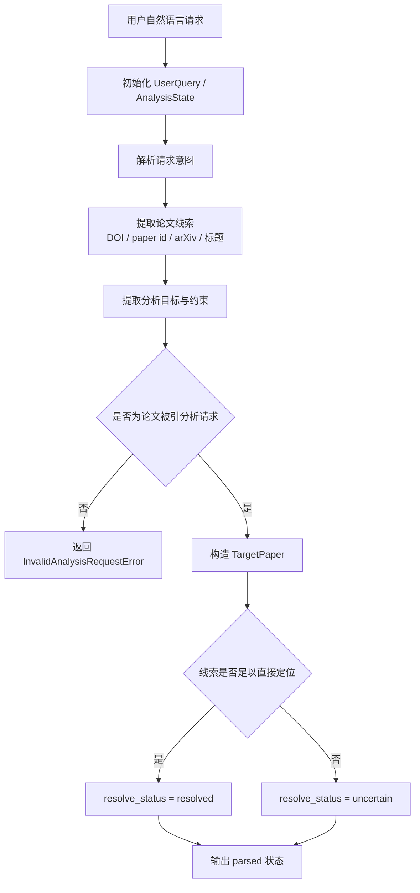

# CiteAnalyzer-Agent MVP 执行计划

## 目标

完成 `CiteAnalyzer-Agent` 的 MVP 落地，构建一个以 `论文被引分析智能体` 为总控主体、以多个原始命名不变且各自具备任务域自治能力的子智能体协同工作的系统。首轮交付目标是：输入一篇目标论文后，能够通过总智能体调度各子智能体完成施引文献抓取、学者识别、引用情感分析，并输出 HTML 可视化分析报告。

## 范围

- 包含：
  - 单篇目标论文输入解析与统一标识
  - `论文被引分析智能体` 的总控编排骨架
  - 以大模型为中心并可调用工具的 `文献爬取智能体`
  - 以大模型为中心并可调用工具的 `学者识别智能体`
  - 以大模型为中心并可调用工具的 `引用情感分析智能体`
  - 以大模型为中心并可调用工具的 `可视化报告智能体`
  - HTML 报告生成
  - 端到端样本验证
- 不包含：
  - 多篇目标论文联合分析
  - 主题级长期监控
  - PDF 首版交付
  - 在线 Web 产品化界面
  - 自训练高精度分类模型

## 背景

- 相关文档：
  - `docs/product-specs/citation-analysis-mvp.md`
  - `docs/ARCHITECTURE.md`
  - `docs/references/python-development-stack.md`
  - `docs/references/langchain-overview.md`
  - `docs/references/langgraph-overview.md`
  - `docs/references/langchain-langgraph-for-citeanalyzer.md`
- 已知约束：
  - `Semantic Scholar + Crossref` 为施引抓取主链路
  - `Google Scholar` 作为补充源，不阻塞主流程
  - `arXiv` 仅作为输入兼容入口
  - HTML 为当前默认报告交付格式
  - 情感分析仅对成功提取上下文的记录执行
  - 重量级学者标注采用启发式规则

## 实现路线

当前路线采用：

- `LangGraph`：用于 `论文被引分析智能体` 的总控状态编排
- `LangChain`：用于模型调用、工具封装、结构化输出辅助
- 项目内部共享对象：用于在总智能体与子智能体之间传递稳定结构

系统整体不是“固定顺序脚本流水线”，而是：

- 一个总智能体
- 四个保留原始名字且各自围绕任务目标工作的子智能体
- 若干由子智能体按需调用的工具能力

## 风险

- 风险：LangGraph 状态设计过重，导致首轮实现复杂度上升
  - 缓解方式：首版只保留最小状态字段和必要节点
- 风险：外部 API 字段不一致
  - 缓解方式：优先定义标准对象，再做适配器
- 风险：全文获取不稳定，影响情感分析覆盖率
  - 缓解方式：允许返回“无法判断”，不阻塞报告生成
- 风险：双人协作导致共享数据结构频繁变动
  - 缓解方式：由主导人统一维护共享模型与节点接口
- 风险：子智能体 agent 化后行为不可控
  - 缓解方式：将自治范围限制在各自任务域内，并由总智能体统一控制顺序和降级

## 角色分工

### 主导人

- 负责产品规格、架构和 execution plan 维护
- 负责总智能体状态设计与 LangGraph 编排
- 负责目标论文解析与文献抓取主链路
- 负责最终集成、报告生成和验收

### 协作者

- 负责学者识别智能体
- 负责重量级学者规则实现
- 负责引用情感分析智能体
- 负责对应模块的局部验证
- 负责 `Google Scholar` 补充源探索

## 预计工期

1. 总智能体状态骨架与共享对象：2 天
2. 文献爬取智能体：3 天
3. `Google Scholar` 补充源探索：2 天
4. 学者识别智能体：3 天
5. 引用情感分析智能体：3 天
6. 可视化报告智能体：3 天
7. 端到端联调与收尾：2 天

总计：约 18 天  
如果外部 API 接入顺利且情感分析范围控制得当，可压缩到约 2 周。

## 里程碑

1. 总智能体骨架
   - 完成 `论文被引分析智能体` 的最小状态和最小图结构
2. 文献爬取智能体
   - 跑通 `Semantic Scholar + Crossref` 主链路
3. 学者识别智能体
   - 跑通 `OpenAlex / DBLP` 与重量级学者规则
4. 引用情感分析智能体
   - 跑通上下文提取、分类与“无法判断”降级
5. 可视化报告智能体
   - 生成 HTML 报告与图表
6. 端到端验收
   - 以真实样本论文完成全链路验证

## 任务分阶段拆解

### 阶段 1：自然语言输入理解与状态初始化

- 负责人：主导人
- 目标：
  - 让 `论文被引分析智能体` 能接收自然语言输入
  - 从自然语言中抽取目标论文线索、分析目标和约束条件
  - 初始化总智能体状态对象
- 交付物：
  - `UserQuery` / `AnalysisState` 等最小状态对象
  - 自然语言输入解析节点
  - 可运行的总智能体入口骨架
- 依赖：
  - 无

#### 阶段 1 流程图

#### 阶段 1 TODO

- [x] 明确自然语言输入对象的最小字段结构
- [x] 明确总智能体状态字段
- [x] 明确 `TargetPaper` 最小字段结构
- [x] 明确总智能体入口输入参数格式
- [x] 搭建 `apps/analyzer/` 最小入口骨架
- [x] 搭建 LangGraph 状态图最小骨架
- [x] 定义总智能体与子智能体的最小接口
- [x] 接入 `.env` 中的模型配置读取逻辑
- [x] 实现自然语言输入理解节点
- [x] 让模型从用户输入中抽取目标论文线索
- [x] 让模型从用户输入中抽取分析目标
- [x] 让模型从用户输入中抽取约束条件
- [x] 对非论文被引分析请求返回明确错误
- [x] 对目标论文线索不足的请求返回 `uncertain` 状态
- [x] 输出标准化的总智能体状态对象
- [x] 用 3~5 条真实自然语言样本做本地验证
- [x] 添加 `scripts/test_agent/stage1.py` 阶段验证脚本
- [x] 更新 execution plan 的阶段进度

#### 阶段 1 验证记录

- `帮我分析一下 Attention Is All You Need 的被引情况`
  - 识别为 `citation_analysis`
  - 提取标题线索 `Attention Is All You Need`
  - `TargetPaper.resolve_status = uncertain`
- `请查看 DOI 为 10.1145/3368089.3409740 的论文有哪些施引文献`
  - 识别为 `citation_analysis`
  - 提取 DOI `10.1145/3368089.3409740`
  - `TargetPaper.resolve_status = resolved`
- `分析一下这篇 arXiv 论文 https://arxiv.org/abs/1706.03762 的引用情感`
  - 识别为 `citation_analysis`
  - 提取 arXiv 编号 `1706.03762`
  - `TargetPaper.resolve_status = resolved`
- `我想知道 openalex:W2741809807 这篇论文的主要引用者和情感倾向`
  - 识别为 `citation_analysis`
  - 提取 OpenAlex 论文标识 `W2741809807`
  - `TargetPaper.resolve_status = resolved`
- `帮我总结一下 LangGraph 是什么`
  - 返回 `InvalidAnalysisRequestError`
  - 被正确识别为非论文被引分析请求

### 阶段 2：文献爬取智能体

- 负责人：主导人
- 配合：协作者
- 目标：
  - 让 `文献爬取智能体` 围绕“获取施引文献”这一目标工作
  - 接入 `Semantic Scholar`
  - 接入 `Crossref`
  - 完成抓取、多源融合、去重和来源保留
- 交付物：
  - 施引文献统一清单
  - 来源追踪信息
  - 可被总智能体调用的文献爬取能力节点
- 依赖：
  - 阶段 1

#### 阶段 2 TODO

- [ ] 明确 `CitingPaper` 最小字段结构
- [ ] 定义文献爬取智能体的状态输入输出接口
- [ ] 搭建 `packages/citation-sources/` 基础目录结构
- [x] 搭建 `packages/citation_sources/` 基础目录结构
- [x] 实现 `Semantic Scholar` 客户端封装
- [x] 实现 `Crossref` 客户端封装
- [x] 实现文献爬取智能体的主抓取策略
- [ ] 统一不同来源字段结构
- [ ] 实现来源追踪字段保留
- [ ] 实现主链路去重逻辑
- [x] 将文献爬取智能体接入总智能体状态图
- [ ] 用 1 篇真实目标论文验证抓取与去重结果
- [x] 添加 `scripts/test_agent/stage2.py` 阶段验证脚本
- [ ] 更新 execution plan 的阶段进度

### 阶段 3：Google Scholar 补充源探索

- 负责人：协作者
- 配合：主导人
- 目标：
  - 评估 `Google Scholar` 的补充价值和接入方式
- 交付物：
  - 补充源接入结论
  - 降级策略说明
- 依赖：
  - 阶段 2

#### 阶段 3 TODO

- [ ] 调研 `Google Scholar` 可获取字段
- [ ] 明确与 `CitingPaper` 的字段映射
- [ ] 评估稳定性、维护性与合规风险
- [ ] 定义补充源失败时的降级路径
- [ ] 明确是否纳入首轮代码实现
- [ ] 添加 `scripts/test_agent/stage3.py` 阶段验证脚本
- [ ] 更新 execution plan 的阶段进度

### 阶段 4：学者识别智能体

- 负责人：协作者
- 配合：主导人
- 目标：
  - 让 `学者识别智能体` 围绕“理解施引作者影响力”这一目标工作
  - 完成作者画像补充与重量级学者标注
- 交付物：
  - `AuthorProfile`
  - `ScholarLabel`
  - 可被总智能体调用的学者识别能力节点
- 依赖：
  - 阶段 2

#### 阶段 4 TODO

- [ ] 明确 `AuthorProfile` 与 `ScholarLabel` 的最小字段结构
- [ ] 定义学者识别智能体的状态输入输出接口
- [ ] 搭建 `packages/author-intel/` 基础目录结构
- [ ] 实现 `OpenAlex` 客户端封装
- [ ] 实现 `DBLP` 客户端封装
- [ ] 实现学者识别智能体的作者标准化与基础消歧策略
- [ ] 实现高影响力作者候选判定
- [ ] 实现重量级学者候选判定
- [ ] 定义缺失 `h-index` 的弱标注策略
- [ ] 将学者识别智能体接入总智能体状态图
- [ ] 用真实样本验证作者画像与标注结果
- [ ] 添加 `scripts/test_agent/stage4.py` 阶段验证脚本
- [ ] 更新 execution plan 的阶段进度

### 阶段 5：引用情感分析智能体

- 负责人：协作者
- 配合：主导人
- 目标：
  - 让 `引用情感分析智能体` 围绕“理解引用态度”这一目标工作
  - 完成引用上下文提取与情感分类
- 交付物：
  - `CitationContext`
  - 情感标签结果
  - 可被总智能体调用的情感分析能力节点
- 依赖：
  - 阶段 2

#### 阶段 5 TODO

- [ ] 明确 `CitationContext` 最小字段结构
- [ ] 定义引用情感分析智能体的状态输入输出接口
- [ ] 搭建 `packages/sentiment/` 基础目录结构
- [ ] 明确可接受的全文输入来源
- [ ] 实现引用情感分析智能体的引用标记定位逻辑
- [ ] 实现引用情感分析智能体的上下文提取逻辑
- [ ] 实现正向 / 中性 / 批评性 / 无法判断标签体系
- [ ] 实现基于规则或 `LLM zero-shot` 的分类入口
- [ ] 定义全文缺失与上下文缺失的降级策略
- [ ] 将引用情感分析智能体接入总智能体状态图
- [ ] 用真实样本验证提取与分类结果
- [ ] 添加 `scripts/test_agent/stage5.py` 阶段验证脚本
- [ ] 更新 execution plan 的阶段进度

### 阶段 6：可视化报告智能体

- 负责人：主导人
- 配合：协作者
- 目标：
  - 让 `可视化报告智能体` 围绕“组织和输出最终分析结果”这一目标工作
  - 汇总结果并生成 HTML 报告
- 交付物：
  - `ReportArtifact`
  - 图表文件
  - HTML 报告
  - 可被总智能体调用的报告生成能力节点
- 依赖：
  - 阶段 2
  - 阶段 4
  - 阶段 5

#### 阶段 6 TODO

- [ ] 明确 `ReportArtifact` 最小字段结构
- [ ] 定义可视化报告智能体的状态输入输出接口
- [ ] 搭建 `packages/reporting/` 基础目录结构
- [ ] 实现引用趋势图
- [ ] 实现引用来源地图
- [ ] 实现重量级学者分布
- [ ] 实现引用情感分布
- [ ] 实现可视化报告智能体的 HTML 报告模板与导出逻辑
- [ ] 将可视化报告智能体接入总智能体状态图
- [ ] 用真实样本验证 HTML 报告输出
- [ ] 添加 `scripts/test_agent/stage6.py` 阶段验证脚本
- [ ] 更新 execution plan 的阶段进度

### 阶段 7：端到端联调与交付

- 负责人：主导人
- 配合：协作者
- 目标：
  - 用真实样本跑通全链路
  - 完成文档与结果收尾
- 交付物：
  - 端到端运行结果
  - 阶段性交付记录
- 依赖：
  - 阶段 4
  - 阶段 5
  - 阶段 6

#### 阶段 7 TODO

- [ ] 选定端到端验证样本论文
- [ ] 运行总智能体状态图完成全链路分析
- [ ] 检查抓取、学者标注、情感分析、报告输出是否一致
- [ ] 修复节点之间的状态字段问题
- [ ] 验证补充源失败、全文缺失、指标缺失等降级路径
- [ ] 添加 `scripts/test_agent/stage7.py` 阶段验证脚本
- [ ] 更新 README、history 和相关文档
- [ ] 更新 execution plan 的阶段进度

## 验证方式

- 命令：
  - `bash ./scripts/ci.sh`
  - `python ./scripts/test_agent/run.py`
  - `python ./scripts/test_agent/stage1.py`
  - 后续补充模块级运行命令和端到端执行命令
- 手工检查：
  - 输入单篇目标论文后，能输出施引文献清单
  - 能输出重量级学者标注结果
  - 能对部分引用输出情感标签
  - 能生成 HTML 报告
  - 报告包含趋势图、来源地图、学者分布、情感分布
- 观测检查：
  - 记录各数据源请求状态
  - 记录去重前后文献数量
  - 记录情感分析成功 / 失败数量
  - 记录重量级学者标注命中数量
  - 记录最终报告导出路径
  - 记录总智能体节点调用顺序与降级决策

## 进度记录

- [x] 完成产品规格与架构文档
- [ ] 完成重写后的 active execution plan
- [x] 完成总智能体状态骨架
- [ ] 完成文献爬取智能体主链路
- [ ] 完成 `Google Scholar` 补充源探索
- [ ] 完成学者识别智能体
- [ ] 完成引用情感分析智能体
- [ ] 完成可视化报告智能体
- [ ] 完成端到端验证
- [ ] 更新 README、history 和相关文档

## 决策记录

- 2026-04-24：系统采用“一个总智能体 + 多个原始命名不变的子智能体”的架构。
- 2026-04-24：`Semantic Scholar + Crossref` 作为主抓取链路，`Google Scholar` 仅作为补充源。
- 2026-04-24：`arXiv` 仅作为输入兼容入口，不作为施引抓取主来源。
- 2026-04-24：首版报告以 HTML 为默认交付格式。
- 2026-04-24：重量级学者采用启发式规则标注，不做跨领域标准化排名。
- 2026-04-24：引用来源地图以施引作者所属机构的国家 / 地区信息为准，多机构时优先按第一作者机构统计。
- 2026-04-25：实现路线调整为 `LangGraph` 做总控状态编排，`LangChain` 做工具与模型调用辅助。
