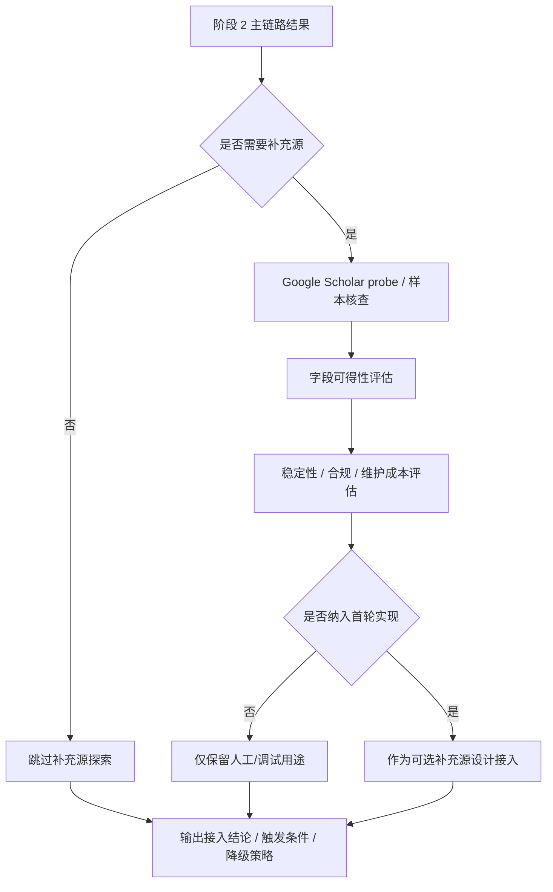

# 阶段 3 执行计划：Google Scholar 补充源探索

## 目标

将主 MVP 计划中的“阶段 3：Google Scholar 补充源探索”细化为一份独立的执行计划。目标不是立刻把 `Google Scholar` 强行接入主链路，而是系统评估它在阶段 2 主抓取链路之外的补充价值、可维护性、合规风险和最小接入方式，为是否进入首轮实现给出清晰结论。

## 范围

- 包含：
  - 明确 `Google Scholar` 在当前项目中的职责边界
  - 评估它能补哪些字段、能不能补 citation coverage
  - 评估稳定性、维护性与合规风险
  - 设计“可选补充源”接入策略与降级路径
  - 规划阶段 3 的验证脚本与样本观察点
- 不包含：
  - 把 `Google Scholar` 变成主 citation source
  - 大规模持续爬取
  - 绕过站点限制的重型基础设施
  - 学者识别、情感分析、报告生成

## 背景

- 父计划：
  - `docs/exec-plans/active/2026-04-24-citation-analysis-mvp.md`
- 相关文档：
  - `docs/ARCHITECTURE.md`
  - `docs/product-specs/citation-analysis-mvp.md`
  - `docs/references/citation-source-apis.md`
  - `docs/testing/stage-validation.md`
- 相关代码路径：
  - `packages/citation_sources/`
  - `docs/generated/`
- 已知约束：
  - 阶段 2 已经以 `Semantic Scholar + Crossref` 跑通主链路
  - `Google Scholar` 在 MVP 中只能作为补充源，不应阻塞主流程
  - 需要把“能补什么”和“代价是什么”说清楚，而不是只凭直觉决定

## 阶段目标拆解

### 目标 A：先明确 `Google Scholar` 的职责边界

阶段 3 必须先回答：

1. 它是补 citation coverage，还是补 metadata？
2. 它是在主抓取结果为空时兜底，还是在主抓取结果不足时补充？
3. 它进入系统后，失败时影响范围是什么？

当前建议边界：

- 不参与目标论文标准化
- 不承担主 citation graph source 角色
- 只在以下场景考虑调用：
  - 主链路候选数量明显偏少
  - 某些经典论文在主链路缺失施引覆盖
  - 需要人工核查时提供补充候选

### 目标 B：明确字段价值

需要调研 `Google Scholar` 在当前项目里最可能补的字段：

- 施引论文标题
- 作者列表
- 年份
- 会议 / 期刊名
- 施引候选数量
- 可能的引用入口链接

不应对它做的过高假设：

- 稳定返回结构化 DOI
- 可长期稳定批量抓取
- 能作为正式的 citation graph API 替代品

### 目标 C：给出“是否纳入首轮实现”的明确结论

阶段 3 的输出不应是模糊描述，而应是清晰决策：

- 纳入首轮实现
- 不纳入首轮实现
- 只保留人工/调试用途

## 阶段 3 接入决策图

## 评估维度

### 1. 数据价值

评估问题：

- 对主链路漏掉的 citing papers 是否有补充价值
- 标题 / 作者 / venue 是否比当前主链路更丰富
- 是否能为人工核查提供候选集

### 2. 工程稳定性

评估问题：

- 是否需要浏览器自动化
- 页面结构是否容易变
- 是否容易受验证码、频率限制或地区因素影响

### 3. 合规与维护成本

评估问题：

- 是否容易违反使用条款或触发封禁
- 是否需要额外代理或浏览器环境
- 后续维护成本是否和其补充价值相匹配

## 推荐输出

阶段 3 建议输出以下结构化结论：

- `field_coverage_matrix`
  - 各字段是否值得依赖
- `use_cases`
  - 适合调用的场景
- `exclusion_cases`
  - 明确不适合调用的场景
- `operational_risks`
  - 合规 / 稳定性 / 维护性风险
- `integration_decision`
  - 是否纳入首轮实现
- `fallback_strategy`
  - 失败时系统如何表现

## 代码落点建议

如果最终要保留最小接入能力，建议目录边界如下：

- `packages/citation_sources/google_scholar_probe.py`
- `packages/citation_sources/google_scholar_types.py`
- `scripts/test_agent/stage3.py`

这条链路的定位更像：

- `probe / supplement`

而不是：

- 正式主客户端

## 推荐接入策略

### 策略 A：只做调试/人工辅助

特点：

- 不接入默认主路径
- 只在脚本或手工核查场景下调用

适合：

- 当前 MVP 早期
- 风险最低

### 策略 B：作为“主链路结果不足”时的可选补充源

触发条件建议：

- `semantic_scholar_candidates` 低于阈值
- 目标论文为典型高被引论文但结果明显异常

要求：

- 结果必须明确标注 `source_name = google_scholar`
- 失败不能阻塞主流程

### 当前推荐

优先推荐 **策略 A**，视调研结果决定是否升级到策略 B。

## 降级策略

`Google Scholar` 失败时：

- 继续返回阶段 2 主链路结果
- 在摘要中记录“补充源未执行 / 失败”
- 不影响阶段 4、5、6 的正常推进

## 验证方式

- 命令：
  - `python ./scripts/test_agent/stage3.py`
  - 如需浏览器探针，再补单独脚本命令
- 手工检查：
  - 固定一篇主链路结果偏少的论文，观察是否能补出额外候选
  - 记录页面结构、字段可获得性和稳定性
- 观测检查：
  - 记录每次调用是否成功
  - 记录补充候选数量
  - 记录是否需要额外人工介入

## 里程碑

1. 明确 `Google Scholar` 在系统中的职责边界
2. 完成字段价值与补充价值评估
3. 完成稳定性 / 合规 / 维护成本评估
4. 给出明确的接入结论
5. 为阶段 3 验证脚本预留入口

## 进度记录

- [ ] 新建阶段 3 细化执行计划
- [ ] 明确 `Google Scholar` 的职责边界
- [ ] 形成字段价值矩阵
- [ ] 形成稳定性与合规风险结论
- [ ] 给出是否纳入首轮实现的决策
- [ ] 规划 `scripts/test_agent/stage3.py` 验证入口
- [ ] 将阶段 3 计划与父计划建立引用关系

## 决策记录

- 2026-04-26：阶段 3 以“补充源探索”而不是“主链路实现”为定位，优先回答值不值得接入，而不是默认先写代码。
