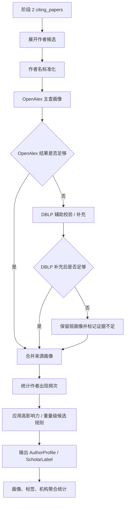

# 阶段 4 执行计划：学者识别智能体细化

## 目标

将主 MVP 计划中的“阶段 4：学者识别智能体”细化成一份可独立推进的执行计划。目标是基于阶段 2 已产出的 `citing_papers`，补充作者画像、作者指标和作者所属机构信息，并按仓库既定启发式规则输出“高影响力作者候选”和“重量级学者候选”。

## 范围

- 包含：
  - 定义阶段 4 的共享对象与状态边界
  - 明确 `OpenAlex` 与 `DBLP` 的分工
  - 设计作者标准化、作者匹配、画像补全和标注规则
  - 规划阶段 4 的验证脚本与样本
  - 规划与阶段 2 / 阶段 6 的输入输出衔接
- 不包含：
  - 正式学术排名系统
  - 跨领域标准化评分模型
  - 人工审稿工作流
  - 最终报告排版

## 背景

- 父计划：
  - `docs/exec-plans/active/2026-04-24-citation-analysis-mvp.md`
- 上游计划：
  - `docs/exec-plans/active/2026-04-25-stage2-citation-fetch-agent.md`
- 相关文档：
  - `docs/ARCHITECTURE.md`
  - `docs/product-specs/citation-analysis-mvp.md`
  - `docs/testing/stage-validation.md`
- 相关代码路径：
  - `packages/citation_sources/`
  - `packages/shared/`
- 已知约束：
  - 阶段 4 消费阶段 2 的 `citing_papers`
  - 第一版只做启发式重量级学者标注
  - 机构信息只能作为辅助信号，不能单独决定标注结论

## 阶段目标拆解

### 目标 A：先定义作者对象与标注对象

阶段 4 必须先冻结两类对象：

- `AuthorProfile`
- `ScholarLabel`

最小目标不是把作者建成“完美知识图谱”，而是：

- 让阶段 6 能拿到可展示的作者画像与标签
- 让阶段 4 自己的规则有稳定输入

### 目标 B：明确定义两个外部源的职责

建议分工：

`OpenAlex`

- 作为主画像源
- 负责作者 ID、机构、领域和引用指标

`DBLP`

- 作为计算机领域辅助源
- 负责作者名、论文关联、会议/期刊上下文辅助校验

### 目标 C：把“作者补全”与“作者标注”分开

阶段 4 不应把这两件事写在一个大函数里：

1. 作者标准化与候选匹配
2. 画像补全
3. 启发式标签计算
4. 聚合统计

## 阶段 4 流程图

## 共享数据设计

### `AuthorProfile`

建议最小字段：

- `author_id`
- `name`
- `source_ids`
- `affiliations`
- `fields`
- `h_index`
- `citation_count`
- `works_count`
- `evidence_sources`

说明：

- `source_ids` 应允许同时保留 `openalex`、`dblp` 等来源标识
- `evidence_sources` 用于说明画像来自哪些外部源

### `ScholarLabel`

建议最小字段：

- `author_id`
- `label`
- `evidence`
- `confidence_note`
- `trigger_rules`

其中：

- `label` 第一版建议至少支持：
  - `high_impact_candidate`
  - `heavyweight_candidate`
  - `weak_signal_candidate`

## 规则设计

### 高影响力作者候选

建议规则：

- `h_index >= 30`

### 重量级学者候选

建议规则：

- 满足 `h_index >= 30`
- 且在施引集合中出现 2 次及以上

### 弱标注

在以下场景使用：

- 没有 `h_index`
- 来源匹配不够稳定
- 机构或领域信息不完整

输出要求：

- 明确写出“证据不足”
- 不要装作高置信度判断

## 代码落点建议

建议新增目录：

- `packages/author_intel/__init__.py`
- `packages/author_intel/models.py`
- `packages/author_intel/clients/openalex.py`
- `packages/author_intel/clients/dblp.py`
- `packages/author_intel/normalize.py`
- `packages/author_intel/rules.py`
- `packages/author_intel/service.py`

职责划分：

- `models.py`
  - `AuthorProfile` / `ScholarLabel`
- `clients/*`
  - 外部源请求与原始响应适配
- `normalize.py`
  - 作者名标准化、候选匹配、来源对齐
- `rules.py`
  - 重量级学者启发式规则
- `service.py`
  - 对外暴露给总智能体使用的入口

## 推荐主链路

### 输入

- `citing_papers`

### 执行顺序

1. 从 `citing_papers` 展开作者候选
2. 对作者名做标准化
3. 用 `OpenAlex` 主查作者画像
4. 必要时用 `DBLP` 做辅助匹配
5. 聚合作者出现频次
6. 应用规则生成 `ScholarLabel`
7. 输出画像、标签与机构聚合统计

## 风险

- 风险：作者重名导致误匹配
  - 缓解方式：保留弱标注，不强行合并作者
- 风险：不同平台指标口径不一致
  - 缓解方式：第一版以来源内指标为准，不做跨源数值混合
- 风险：机构字段缺失或噪声大
  - 缓解方式：机构只做辅助信号

## 验证方式

- 命令：
  - `python ./scripts/test_agent/stage4.py`
- 手工检查：
  - 给定一组施引论文作者，能输出非空画像结果
  - 对缺少 `h-index` 的作者，能输出弱标注
  - 对重复出现作者，能提高其候选优先级
- 观测检查：
  - 记录作者总数
  - 记录成功匹配画像的作者数
  - 记录高影响力 / 重量级 / 弱标注数量

## 里程碑

1. 冻结 `AuthorProfile` / `ScholarLabel`
2. `OpenAlex` 主画像链路跑通
3. `DBLP` 辅助链路跑通
4. 标签规则与聚合统计跑通
5. 阶段 4 验证脚本完成
6. 接入总智能体状态图

## 进度记录

- [ ] 新建阶段 4 细化执行计划
- [ ] 定义 `AuthorProfile` / `ScholarLabel`
- [ ] 明确 `OpenAlex` 与 `DBLP` 的职责分工
- [ ] 设计作者标准化与候选匹配策略
- [ ] 设计启发式标签规则
- [ ] 规划 `packages/author_intel/` 模块边界
- [ ] 规划 `scripts/test_agent/stage4.py` 验证入口
- [ ] 将阶段 4 计划与父计划建立引用关系

## 决策记录

- 2026-04-26：阶段 4 以“作者画像补全 + 启发式标签”作为目标，不在第一版引入跨领域标准化排名。
