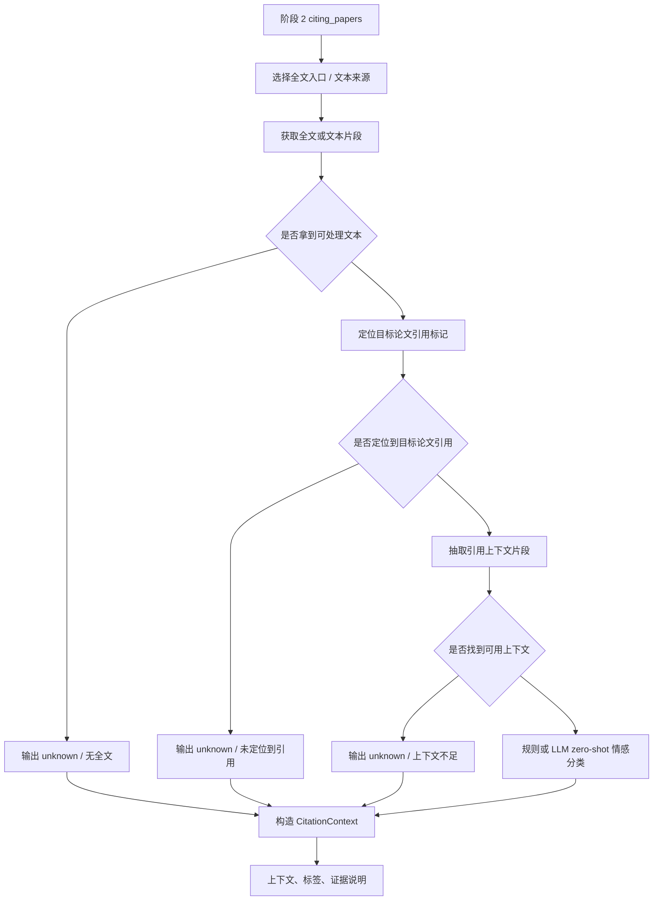

# 阶段 5 执行计划：引用情感分析智能体细化

## 目标

将主 MVP 计划中的“阶段 5：引用情感分析智能体”细化成一份独立的执行计划。目标是基于阶段 2 已产出的 `citing_papers` 与可获取的全文入口，定位施引论文中引用目标论文的上下文片段，并输出正向 / 中性 / 批评性 / 无法判断等情感标签，同时明确证据边界和降级策略。

## 范围

- 包含：
  - 定义阶段 5 的共享对象与状态边界
  - 明确全文入口、引用定位、上下文抽取与情感分类的步骤
  - 规划“无法判断”路径与证据暴露方式
  - 规划阶段 5 的验证脚本与样本
  - 规划与阶段 2 / 阶段 6 的输入输出衔接
- 不包含：
  - 自训练监督模型
  - 人工标注工作台
  - 最终报告排版
  - 高覆盖率全文抓取基础设施

## 背景

- 父计划：
  - `docs/exec-plans/active/2026-04-24-citation-analysis-mvp.md`
- 上游计划：
  - `docs/exec-plans/active/2026-04-25-stage2-citation-fetch-agent.md`
- 相关文档：
  - `docs/ARCHITECTURE.md`
  - `docs/product-specs/citation-analysis-mvp.md`
  - `docs/testing/stage-validation.md`
- 相关代码路径：
  - `packages/citation_sources/`
  - 未来的 `packages/sentiment/`
- 已知约束：
  - 第一版允许使用规则或 `LLM zero-shot`
  - 全文缺失时允许输出“无法判断”
  - 情感分析不能阻塞整份报告生成

## 阶段目标拆解

### 目标 A：先定义输入边界

阶段 5 不能把“找全文”“找引用句子”“做情感分类”混成一层抽象。

它至少依赖：

- `citing_papers`
- 目标论文标识：
  - `doi`
  - `title`
  - `aliases`（后续可扩展）
- 可用全文入口：
  - `source_links`
  - `open_access_urls`
  - 其他后续补充入口

### 目标 B：把“定位上下文”与“情感判断”分开

建议拆成两段：

1. 引用定位与上下文抽取
2. 情感标签判断

这样即使分类策略变化，也不会和全文定位逻辑耦合。

### 目标 C：明确“无法判断”的合法性

阶段 5 的第一版应该明确承认：

- 没拿到全文
- 找不到明确引用句子
- 引用句子过短或噪声太大

这些都可以直接输出：

- `sentiment_label = unknown`
- `evidence_note = unable_to_determine`

而不是硬分类。

## 阶段 5 流程图

## 共享数据设计

### `CitationContext`

建议最小字段：

- `citing_paper_id`
- `context_text`
- `mention_span`
- `matched_target_reference`
- `sentiment_label`
- `evidence_note`

说明：

- `matched_target_reference` 用于说明是通过 DOI、标题还是其他别名定位到的
- `evidence_note` 用于解释为什么是 `unknown`

### `SentimentSummary`

建议额外保留汇总对象：

- `total_candidates`
- `fulltext_available`
- `context_found`
- `classified_count`
- `unknown_count`

## 标签体系建议

第一版建议固定四类：

- `positive`
- `neutral`
- `critical`
- `unknown`

定义：

- `positive`
  - 明确支持、采用、扩展目标论文方法
- `neutral`
  - 背景介绍、事实性引用
- `critical`
  - 明确指出缺点、局限或反例
- `unknown`
  - 全文缺失、上下文缺失或判断不可靠

## 代码落点建议

建议新增目录：

- `packages/sentiment/__init__.py`
- `packages/sentiment/models.py`
- `packages/sentiment/fulltext.py`
- `packages/sentiment/reference_locator.py`
- `packages/sentiment/classifier.py`
- `packages/sentiment/service.py`

职责划分：

- `models.py`
  - `CitationContext` / `SentimentSummary`
- `fulltext.py`
  - 全文入口选择与文本获取
- `reference_locator.py`
  - 目标论文引用定位与上下文抽取
- `classifier.py`
  - 规则 / LLM zero-shot 分类
- `service.py`
  - 对外暴露给总智能体的统一入口

## 工作流实现建议

阶段 5 / 当前分支上的引用情感分析模块建议采用 `LangGraph` 驱动的固定工作流，而不是自由式 ReAct。

推荐节点：

1. `load_fulltext_artifact`
   - 加载阶段 5 已准备好的全文文本与本地产物路径
2. `detect_source_kind`
   - 判断当前来源是不是 `TeX/LaTeX`
3. `tex_bibliography_matcher`
   - 如果是 TeX，优先在 `.bib/.bbl/.tex` 中恢复目标论文条目与 citation key
4. `body_citation_finder`
   - 用 citation key / marker 或普通文本策略回正文定位引用上下文
5. `sentiment_classifier`
   - 用 `LLM zero-shot` 对上下文做情感分类
6. `aggregate_output`
   - 构造 `CitationContext` 并更新 `SentimentSummary`

适用原则：

- 工作流顺序由代码固定，不交给自由推理决定。
- LLM 负责高歧义判断，例如：
  - 哪条 bibliography entry 是目标论文
  - 哪个正文窗口是正确的引用上下文
  - 该上下文属于什么情感标签
- TeX 源优先走 bibliography / citation key 路径，普通文本再走通用窗口路径。
- 单篇 paper 的失败应局部降级为 `unknown`，不能中断整批处理。

## 推荐主链路

1. 从阶段 2 的 `citing_papers` 中选择可获取全文的论文
2. 获取文本
3. 定位目标论文引用
4. 提取上下文
5. 做情感分类
6. 输出 `CitationContext`
7. 汇总 `SentimentSummary`

## TeX 引用定位细则

当阶段 5 / 当前分支的引用情感分析模块处理的是来自 `arXiv e-print` 或其他 TeX/LaTeX 源的全文时，优先执行下面这条路径，而不是只看压平后的纯文本：

1. 从阶段 5 的 `extracted_dir` 读取解压后的源文件。
2. 优先检查：
   - `.bib`
   - `.bbl`
   - `.tex`
3. 先 grep 目标论文 DOI。
4. 如果 DOI 缺失，再 grep 目标论文标题中的关键片段。
5. 当在 bibliography / references 中命中目标论文后，恢复对应的 citation key 或 marker。
   典型形式包括：
   - `@article{foo2020,...}`
   - `@inproceedings{foo2020,...}`
   - `\bibitem{foo2020}`
   - `[12]`
6. 恢复 key / marker 后，再回正文 `.tex` 文件中搜索：
   - `\cite{key}`
   - `\citep{key}`
   - `\citet{key}`
   - 或与该条目绑定的数字 marker
7. 把命中的正文句子或相邻段落作为候选引用上下文，再交给 LLM 做情感判断。

执行原则：

- 优先 DOI 精确命中，其次才是标题命中。
- 优先 bibliography 中的目标条目，避免把正文中的顺带提及当成正式引用。
- 如果已经恢复出 citation key，就优先使用 key 回正文定位，而不是退回纯语义猜测。
- 如果 bibliography 中找不到目标论文，允许输出 `unknown`，但要保留失败原因。
- 如果已经有源文件级证据，不要只依赖压平后的 `parsed txt`。

## PDF 路径建议

当阶段 5 / 当前分支上的引用情感分析模块面对的是 PDF 原文，而不是 TeX 源文件时，优先走 GROBID 路径：

1. 将 PDF 提交给本地 GROBID 服务的 `processFulltextDocument`。
2. 获取 TEI XML。
3. 在 `listBibl/biblStruct` 中根据目标论文 DOI / 标题匹配目标参考文献条目。
4. 恢复对应的 `xml:id`。
5. 在正文中找到 `ref type="bibr"` 且 `target="#xml:id"` 的位置。
6. 取该 `ref` 所在段落作为候选引用上下文。
7. 再将该候选上下文交给 LLM 做情感判断。

执行原则：

- 优先使用 DOI 匹配 `biblStruct`，标题匹配作为兜底。
- 正文上下文优先返回包含目标 `ref` 的完整段落，而不是只取短 token 片段。
- GROBID 服务不可用时，才退回当前的普通文本窗口路径。

## 风险

- 风险：很多论文拿不到全文
  - 缓解方式：允许 `unknown`
- 风险：引用定位不稳定
  - 缓解方式：保留 `matched_target_reference` 与 `evidence_note`
- 风险：`LLM zero-shot` 分类波动
  - 缓解方式：第一版允许规则优先，分类结果不过度承诺

## 验证方式

- 命令：
  - `python ./scripts/test_agent/stage5.py`
- 手工检查：
  - 给定少量真实 citing papers，能抽出至少部分上下文
  - 对无法定位的样本输出 `unknown`
  - 情感分类结果带证据说明
- 观测检查：
  - 记录可获取全文数量
  - 记录成功抽取上下文数量
  - 记录四类标签分布

## 里程碑

1. 冻结 `CitationContext` / `SentimentSummary`
2. 全文入口与文本获取跑通
3. 目标论文引用定位跑通
4. 情感标签链路跑通
5. 阶段 5 验证脚本完成
6. 接入总智能体状态图

## 进度记录

- [ ] 新建阶段 5 细化执行计划
- [ ] 定义 `CitationContext` / `SentimentSummary`
- [ ] 明确全文入口与获取策略
- [ ] 设计引用定位与上下文抽取策略
- [ ] 设计情感标签规则
- [ ] 规划 `packages/sentiment/` 模块边界
- [ ] 规划 `scripts/test_agent/stage5.py` 验证入口
- [ ] 将阶段 5 计划与父计划建立引用关系

## 当前分支进展

当前开发分支上已经完成的原型能力包括：

- 阶段 5
  - `arXiv-first` 全文抓取
  - PDF / HTML / LaTeX 解析
  - 本地落盘 `parsed txt + source.tar + extracted/`
- 阶段 6
  - `LangGraph` 工作流骨架
  - TeX bibliography / cite-key 路径
  - GROBID `PDF -> TEI XML -> 引用上下文` 路径
  - 目标引文显式高亮后再交给 LLM 分类

当前尚未完成的关键项：

- 多上下文全部返回
- 更多真实 citing paper 的批量回归
- 学者识别与报告生成链路接入联调

## 决策记录

- 2026-04-26：阶段 5 第一版明确允许 `unknown` 作为合法输出，而不是强制对所有引用做情感分类。
