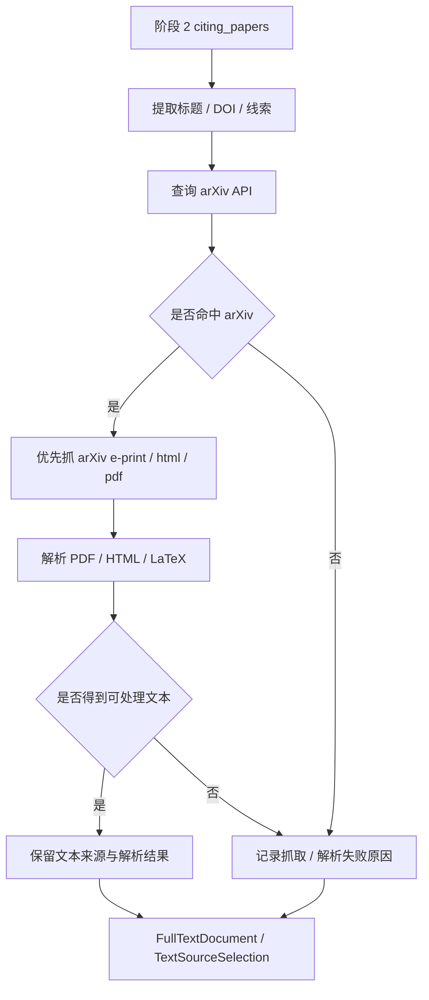

# 阶段 5 执行计划：全文抓取与文本解析阶段细化

## 目标

将主 MVP 计划中的“阶段 5：全文抓取与文本解析阶段”细化成一份独立执行计划。目标是基于阶段 2 已产出的 `citing_papers`，为后续引用情感分析提供可处理的全文文本，优先通过 `arXiv` 获取公开全文，并完成 PDF / HTML / LaTeX 的文本解析与来源记录。

## 范围

- 包含：
  - 定义阶段 5 的共享对象与状态边界
  - 明确 `arXiv-first` 的全文获取策略
  - 设计 PDF / HTML / LaTeX 文本解析路径
  - 设计抓取失败与不可解析文本的错误暴露方式
  - 规划阶段 5 的验证脚本与样本
  - 规划与阶段 2 / 阶段 6 的输入输出衔接
- 不包含：
  - 引用定位
  - 情感分类
  - 受限出版商登录态抓取
  - 最终报告排版

## 背景

- 父计划：
  - `docs/exec-plans/active/2026-04-24-citation-analysis-mvp.md`
- 上游计划：
  - `docs/exec-plans/active/2026-04-25-stage2-citation-fetch-agent.md`
- 下游计划：
  - `docs/exec-plans/active/2026-04-26-stage6-citation-sentiment-agent.md`
- 相关文档：
  - `docs/ARCHITECTURE.md`
  - `docs/product-specs/citation-analysis-mvp.md`
  - `docs/testing/stage-validation.md`
- 相关代码路径：
  - `packages/citation_sources/`
  - `packages/sentiment/fulltext.py`
- 已知约束：
  - 全文入口优先 `arXiv`
  - 其他全文源暂不作为首轮必需链路
  - 抓取或解析失败必须暴露错误，不能静默吞掉

## 阶段目标拆解

### 目标 A：把全文获取从情感分析中拆出来

阶段 5 只负责：

1. 找全文
2. 把全文变成可处理文本
3. 标清来源和失败原因
4. 把对应全文文本保存到本地

它不负责引用定位和情感判断。

### 目标 B：优先建立稳定的公开全文主链路

建议顺序：

1. 根据标题查 `arXiv API`
2. 命中后优先使用：
   - `e-print`
   - `html`
   - `pdf`
3. 若 `arXiv` 未命中，再保留其他来源接口位点，但首轮可先不补全

### 目标 C：失败要可见

阶段 5 不应该把抓取失败吞掉。

需要显式保留：

- 哪个来源尝试过
- 为什么失败
- 最后是否拿到可解析文本

## 阶段 5 流程图

## 共享数据设计

### `FullTextDocument`

建议最小字段：

- `citing_paper_id`
- `text`
- `source_type`
- `source_label`
- `local_path`

### `TextSourceSelection`

建议最小字段：

- `citing_paper_id`
- `text`
- `source_type`
- `source_label`
- `evidence_note`

## 代码落点建议

- `packages/sentiment/fulltext.py`
- `packages/sentiment/models.py`
- `packages/sentiment/service.py`

职责划分：

- `fulltext.py`
  - 全文入口选择
  - `arXiv` 查询与抓取
  - PDF / HTML / LaTeX 解析
- `models.py`
  - `FullTextDocument`
  - `TextSourceSelection`
- `service.py`
  - 阶段 5 与阶段 6 的串接入口

## 推荐主链路

1. 从阶段 2 的 `citing_papers` 中抽标题和 DOI
2. 查询 `arXiv API`
3. 选择可用公开全文入口
4. 解析出正文文本
5. 输出结构化全文对象
6. 将对应文章文本保存到 `downloaded-papers/stage5/`
7. 供阶段 6 做引用定位与情感分类

## 风险

- 风险：目标论文不在 `arXiv`
  - 缓解方式：显式报错并保留后续其他来源扩展点
- 风险：PDF 文本抽取质量差
  - 缓解方式：保留 `source_type` 和失败日志，必要时改走 `html` / `latex`
- 风险：来源页面不是正文而是落地页
  - 缓解方式：限制首轮以 `arXiv` 公开全文为主，不把 DOI 落地页当正文主链路

## 验证方式

- 命令：
  - `python ./scripts/test_agent/stage5.py`
- 手工检查：
  - 本地 PDF / HTML / LaTeX 样本都能抽出文本
  - 无全文样本返回空结果
  - `arXiv` live smoke 能拉到真实文本
- 观测检查：
  - 记录获取成功数量
  - 记录解析成功数量
  - 记录失败来源和失败原因

## 里程碑

1. 冻结 `FullTextDocument` / `TextSourceSelection`
2. `arXiv` 查询链路跑通
3. PDF / HTML / LaTeX 解析跑通
4. 阶段 5 验证脚本完成
5. 接入阶段 6

## 进度记录

- [ ] 新建阶段 5 细化执行计划
- [ ] 明确 `arXiv-first` 全文获取策略
- [ ] 定义全文共享对象
- [ ] 设计 PDF / HTML / LaTeX 解析路径
- [ ] 设计失败日志暴露方式
- [ ] 规划 `scripts/test_agent/stage5.py` 验证入口
- [ ] 将阶段 5 与阶段 6 计划建立引用关系

## 决策记录

- 2026-04-26：全文抓取从情感分析阶段独立出来，形成单独阶段 5。
- 2026-04-26：全文获取首轮采用 `arXiv-first` 策略，不把 DOI 落地页当主正文来源。
