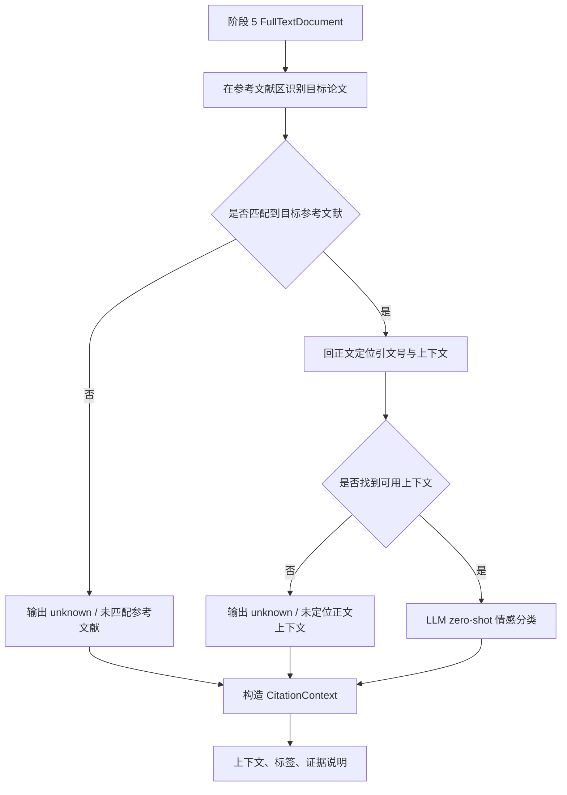

# 阶段 6 执行计划：引用情感分析智能体细化

## 目标

将主 MVP 计划中的“阶段 6：引用情感分析智能体”细化成一份独立的执行计划。目标是基于阶段 2 已产出的 `citing_papers` 与阶段 5 已准备好的全文文本，定位施引论文中引用目标论文的上下文片段，并输出正向 / 中性 / 批评性 / 无法判断等情感标签，同时明确证据边界和降级策略。

## 范围

- 包含：
  - 定义阶段 6 的共享对象与状态边界
  - 明确引用定位、上下文抽取与情感分类的步骤
  - 规划“无法判断”路径与证据暴露方式
  - 规划阶段 6 的验证脚本与样本
  - 规划与阶段 5 / 阶段 7 的输入输出衔接
- 不包含：
  - 自训练监督模型
  - 人工标注工作台
  - 最终报告排版

## 背景

- 父计划：
  - `docs/exec-plans/active/2026-04-24-citation-analysis-mvp.md`
- 上游计划：
  - `docs/exec-plans/active/2026-04-26-stage5-fulltext-acquisition-agent.md`
- 相关文档：
  - `docs/ARCHITECTURE.md`
  - `docs/product-specs/citation-analysis-mvp.md`
  - `docs/testing/stage-validation.md`
- 相关代码路径：
  - `packages/sentiment/`
- 已知约束：
  - 第一版以 `LLM zero-shot` 为中心
  - 情感分析不能阻塞整份报告生成

## 阶段目标拆解

### 目标 A：消费阶段 5 的全文结果

阶段 6 不再承担抓全文职责。

它的直接输入应是：

- `citing_papers`
- `FullTextDocument` / `TextSourceSelection`
- 目标论文标识

### 目标 B：把“定位上下文”与“情感判断”分开

建议拆成两段：

1. 引用定位与上下文抽取
2. 情感标签判断

### 目标 C：明确“无法判断”的合法性

以下情况允许输出：

- `sentiment_label = unknown`
- `evidence_note = unable_to_determine`

场景包括：

- 阶段 5 没有提供可用全文
- 找不到明确引用句子
- 上下文不足以支撑判断

## 阶段 6 流程图

## 共享数据设计

### `CitationContext`

建议最小字段：

- `citing_paper_id`
- `context_text`
- `mention_span`
- `matched_target_reference`
- `sentiment_label`
- `evidence_note`

### `SentimentSummary`

建议额外保留汇总对象：

- `total_candidates`
- `fulltext_available`
- `context_found`
- `classified_count`
- `unknown_count`

## 标签体系建议

第一版固定四类：

- `positive`
- `neutral`
- `critical`
- `unknown`

## 代码落点建议

- `packages/sentiment/llm_locator.py`
- `packages/sentiment/classifier.py`
- `packages/sentiment/service.py`

## 推荐主链路

1. 消费阶段 5 的全文文本
2. 在参考文献区识别目标论文
3. 回正文定位引文号
4. 提取上下文
5. 用 LLM 判断情感
6. 输出 `CitationContext`
7. 汇总 `SentimentSummary`

## 风险

- 风险：参考文献区抽取不稳定
  - 缓解方式：保留 `evidence_note` 与失败说明
- 风险：LLM 判定波动
  - 缓解方式：保留结构化证据说明

## 验证方式

- 命令：
  - `python ./scripts/test_agent/stage6.py`
- 手工检查：
  - 对真实上下文输出情感标签
  - 对无法定位的样本输出 `unknown`

## 里程碑

1. 冻结 `CitationContext` / `SentimentSummary`
2. 引用定位跑通
3. 情感分类跑通
4. 阶段 6 验证脚本完成
5. 接入总智能体状态图

## 进度记录

- [ ] 新建阶段 6 细化执行计划
- [ ] 定义 `CitationContext` / `SentimentSummary`
- [ ] 设计引用定位与上下文抽取策略
- [ ] 设计情感标签规则
- [ ] 规划 `packages/sentiment/` 模块边界
- [ ] 规划 `scripts/test_agent/stage6.py` 验证入口
- [ ] 将阶段 6 计划与父计划建立引用关系

## 决策记录

- 2026-04-26：全文抓取从情感分析阶段独立到阶段 5，阶段 6 专注引用定位与情感判断。
